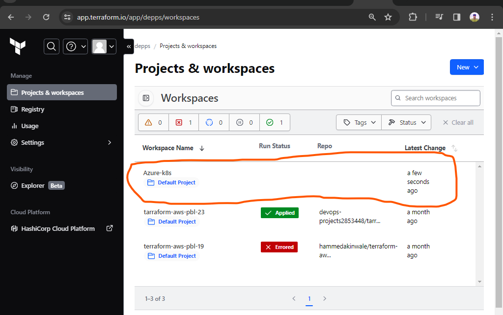
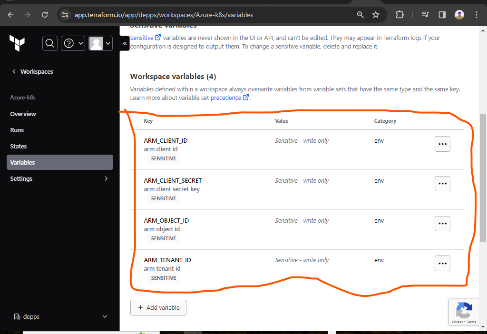
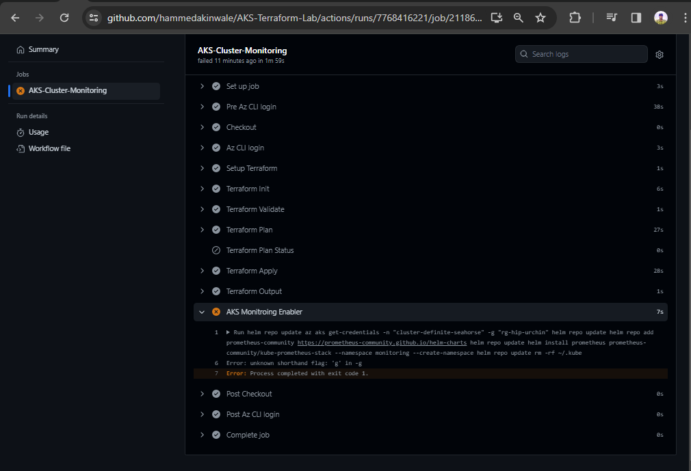

# Deploying a web application into AKS using terraform(IAC)

This application requires a scalable, secure infrastructure with a focus on automation and best practices in cloud infrastructure management.

## Objectives:

# 1. Infrastructure Setup Using Terraform and Azure Kubernetes Services (AKS)

__Steps__

+ I created an organization and created a workspace in the organization on terraform cloud



+ I added the credentials required by terraform to communicate with azure and also create resources on `AZURE` to `terraform cloud`



+ Configured the infrastructure to deploy `AKS`

you can find the `Terraform` configuration [HERE](https://github.com/hammedakinwale/AKS-Terraform-Lab).

+ I also automate the the github workflows using `YAML` files

you can find the `YAML` files [HERE](https://github.com/hammedakinwale/AKS-Terraform-Lab/tree/main/.github/workflows)

# 2. Implement CI/CD Pipelines using GitHub Actions:

## Branch Naming:

+ __Descriptive and clear:__ Names should reflect the purpose of the branch (e.g., "feature-add-user-roles", "bugfix-incorrect-joins").

+ __Consistent prefix:__ Consider using a standard prefix for different branch types (e.g., feature/, bugfix/, hotfix/).

+ __Avoid special characters:__ Stick to alphanumeric characters, hyphens, and underscores for ease of use and compatibility.

## Branching Off:

+ __Branch from a stable__ version: Start new branches from a well-tested and integrated version, like `develop` or `main`.

+ __Isolate changes:__ Each branch should focus on a single feature, bug fix, or release.

+ __Use feature flags:__ If deploying incomplete features, utilize feature flags to control their visibility.

## Merging Strategies:

+ __Feature flags for risky merges:__ When merging risky branches, use feature flags to rollback if needed.

+ __Pull requests for review:__ Encourage pull requests for code review before merging.

+ __Merge conflicts resolution:__ Address conflicts promptly and thoroughly before merging.

+ __Merge into stable branches:__ Merge approved branches into develop or main.

## Handling Conflicts:

+ __Clear communication:__ Discuss potential conflicts early and establish resolution procedures.

+ __Version control tools:__ Utilize version control tools like Git to track changes and revert if needed.

+ __Manual resolution:__ When automated merging fails, resolve conflicts manually.

4. Azure Administration with Terraform:

Use Terraform to set up monitoring, logging, and alerts for the Kubernetes services using 
Azure Monitor and Log Analytics.

+ Azure Administration with Terraform

It is configurated with the below codes:

```
name: Azure AKS Monitroring With Prometheus and Grafana
on:
  workflow_dispatch:

permissions:
      id-token: write
      contents: read
jobs: 
  AKS-Cluster-Monitoring:
    runs-on: ubuntu-latest
    defaults:
      run:
        shell: bash
        working-directory: AKS
    steps:
      - name: Checkout
        uses: actions/checkout@v3.1.0
        
      - name: 'Az CLI login'
        uses: azure/login@v1
        with:
          client-id: ${{ secrets.ARM_CLIENT_ID }}
          tenant-id: ${{ secrets.ARM_TENANT_ID }}
          subscription-id: ${{ secrets.ARM_SUBSCRIPTION_ID }}
  
      - name: Setup Terraform
        uses: hashicorp/setup-terraform@v2.0.2
        with:
          terraform_version: latest
          cli_config_credentials_token: ${{ secrets.TF_API_TOKEN }}

      - name: Terraform Init
        id: init
        run: terraform init
      
      - name: Terraform Validate
        id: validate
        run: terraform validate

      - name: Terraform Plan
        id: plan
        run: terraform plan
        continue-on-error: true

      - name: Terraform Plan Status
        if: steps.plan.outcome == 'failure'
        run: exit 1

      - name: Terraform Apply
        run: terraform apply -auto-approve

      - name: Terraform Output
        run: terraform output

       - name: AKS Monitroing Enabler
        run: |
          az aks get-credentials -n "cluster-definite-seahorse" -rg "rg-hip-urchin"
          helm repo add prometheus-community https://prometheus-community.github.io/helm-charts
          helm repo update
          helm install prometheus prometheus-community/kube-prometheus-stack --namespace monitoring --create-namespace
          rm -rf ~/.kube
```



# CHALLENGES:

+ The major challenges faced is deploying to azure using github action using secret key/ID i was able to fix that by creating federated credential on `AZURE DEVOPS` after alot of research, googling and consulting documantations 

+ Another blocker is installing prometheus to the resources it is conplaining about flags but i am still working on fixing the blocker i just have to stop here for now due to the fact that i don't have enough time for delivering this i will have to update this after finding solutions to the problem or hopefully i will be able to get a solution to it with my potential team mates


THANK YOU
