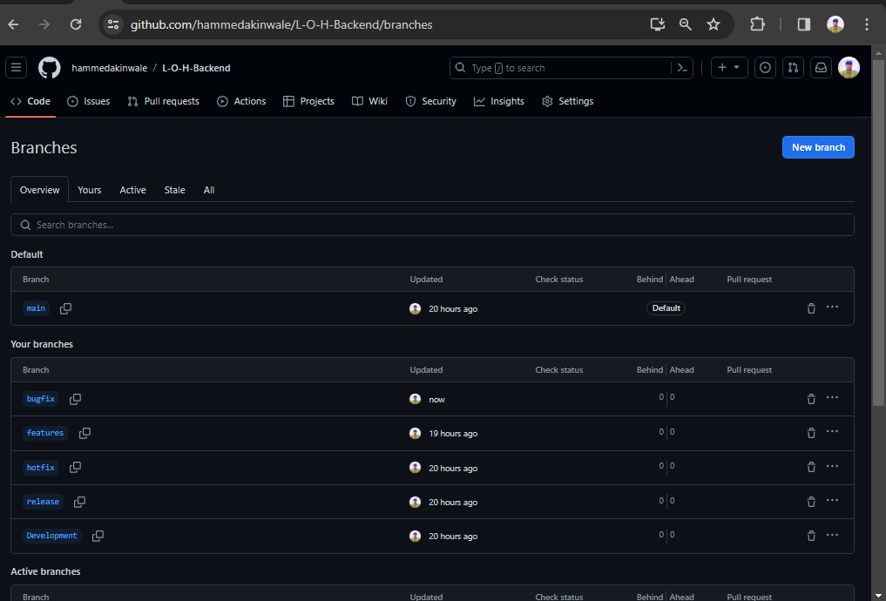
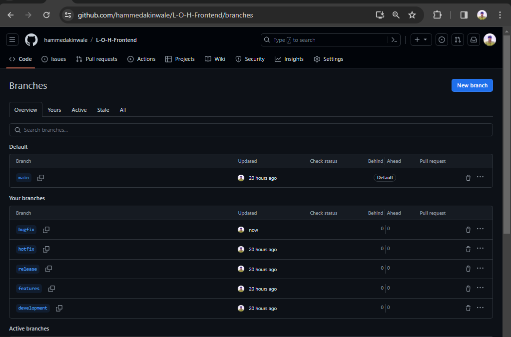
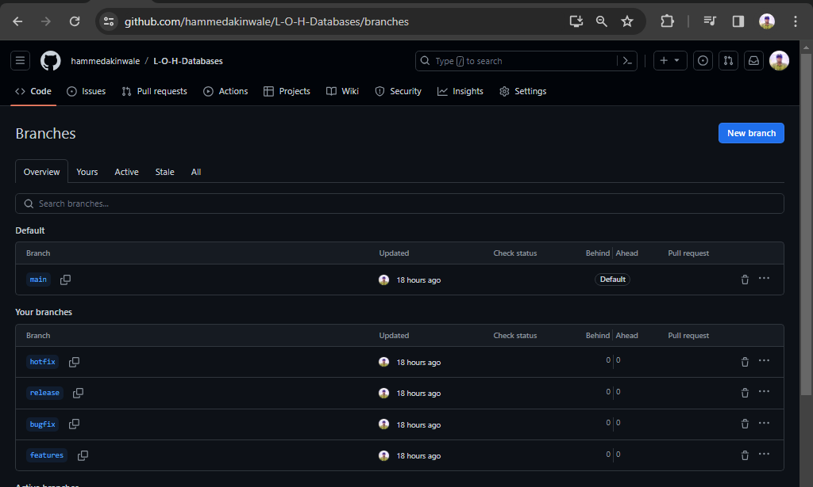
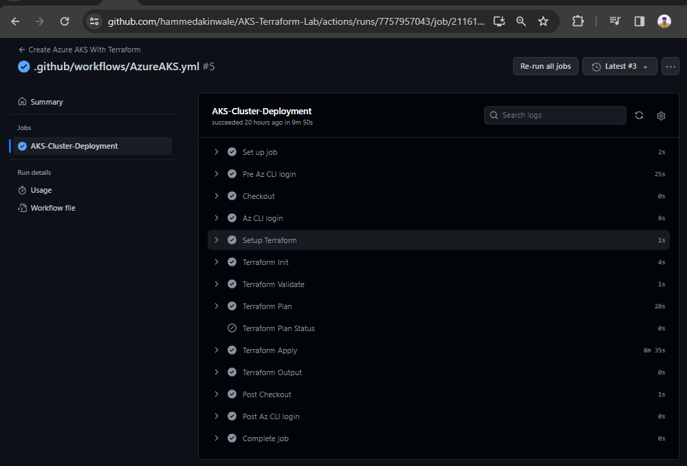
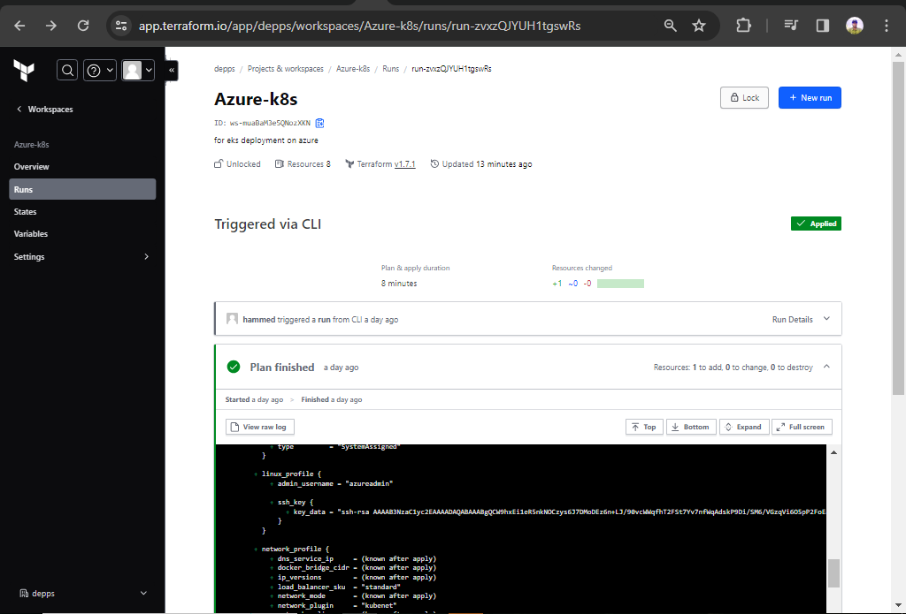

# Deploying a web application into AKS using terraform(IAC)

This application requires a scalable, secure infrastructure with a focus on automation and best practices in cloud infrastructure management.

## Objectives:

# 1. Infrastructure Setup Using Terraform and Azure Kubernetes Services (AKS)

__Steps__

+ I created an organization and created a workspace in the organization on terraform cloud


+ I added the credentials required by terraform to communicate with azure and also create resources on `AZURE` to `terraform cloud`


+ Configured the infrastructure to deploy `AKS`

you can find the `Terraform` configuration [HERE](https://github.com/hammedakinwale/AKS-Terraform-Lab).

+ I also automate the the github workflows using `YAML` files

you can find the `YAML` files [HERE](https://github.com/hammedakinwale/AKS-Terraform-Lab/tree/main/.github/workflows)

# 2. Implement CI/CD Pipelines using GitHub Actions:

+ Seting up GitHub repositories for each microservice with appropriate branching strategies.

the apps consits of three tiers `Backend`, `frontend` and `Database`

# BACKEND REPOSITORY



for Backend part of the applications this is a repos where the typical engineering works happened the branch strategy for this repositories is as follows

checkout the repo [HERE](https://github.com/hammedakinwale/L-O-H-Backend)

# THE BRANCHES:

## MAIN: 

The main branch is the default branch in a repository where the stable and production-ready code is stored. It is the branch that other branches are merged into, and it is the branch that is typically deployed to production. The main branch is often named master or main.

## DEVELOPMENT/FEATURES:

Feature branches are temporary branches created specifically for developing new features, bug fixes, or improvements without directly affecting the main codebase. They serve as isolated environments for working on specific changes without the risk of breaking the working code.

the features branches can varries as the project required or sometimes the organization the branches can be named based on the features type e.g `feature/<features name>`

## BUGFIX BRANCH

It's a temporary branch created to isolate and fix bugs in a database without disrupting the main codebase. Think of it as a dedicated workspace for bug repairs, ensuring stability and control.

## RELEASE BRANCH:

serve as a critical step in the software development lifecycle, bridging the gap between active development and deployment to production. Here's a breakdown of their key features and functions:

release branch varies base on the version of the applications or teatures as the organization require the branches can be named base on the versions type e.g `release/<the version>`

## HOTFIX

A hotfix branch, also known as a patch branch, is a temporary branch in a version control system like Git specifically used for applying urgent fixes to critical bugs or security vulnerabilities in a deployed production environment. Here's a breakdown of its key features and functionalities:

Hotfix branches provide a streamlined way to address critical issues in production without impacting ongoing development on the main branch. They allow you to isolate the fix, test it thoroughly, and quickly deploy it to production with minimal disruption.

workflows:

__Identification and Urgency:__ A critical bug or security flaw is discovered in the production environment that requires immediate attention.

__Creating the Branch:__ A hotfix branch is created directly from the latest commit on the main or master branch (representing the deployed version).

__Developing the Fix:__ Developers work within the hotfix branch to isolate and implement the necessary fix for the identified issue.

__Thorough Testing:__ Rigorous testing ensures the fix itself doesn't introduce new problems and functions as intended.

__Merging and Deploying:__ Once the fix is confirmed, the hotfix branch is merged back into both the main branch (for future releases) and the branch representing the deployed version (usually another stable branch or tag). The fix is then deployed to production environments.

__Rapid Response:__ Enables developers to quickly address critical issues in production without affecting development workflows.

__Isolation of Fixes:__ Prevents accidental changes to other parts of the codebase and minimizes regression risks.

__Controlled Deployment:__ Allows for testing and validation of the fix before pushing it live, ensuring its effectiveness and stability.

__Version Control:__ Hotfix branches provide a record of the specific fix implemented, aiding in future analysis and potential rollbacks if needed

# FRONTEND REPOSITORY

checkout the repo [HERE](https://github.com/hammedakinwale/L-O-H-Frontend)



for frontend part of the applications this is a repos where the where the UI features And development happened it some branches here are similar to backend

## MAIN: 

The main branch is the default branch in a repository where the stable and production-ready code is stored. It is the branch that other branches are merged into, and it is the branch that is typically deployed to production. The main branch is often named master or main.

## DEVELOPMENT/FEATURES:

Feature branches are temporary branches created specifically for developing new features, bug fixes, or improvements without directly affecting the main codebase. They serve as isolated environments for working on specific changes without the risk of breaking the working code.

the features branches can varries as the project required or sometimes the organization the branches can be named based on the features type e.g `feature/<features name>`

## BUGFIX BRANCH

It's a temporary branch created to isolate and fix bugs in a database without disrupting the main codebase. Think of it as a dedicated workspace for bug repairs, ensuring stability and control.

## RELEASE BRANCH:

serve as a critical step in the software development lifecycle, bridging the gap between active development and deployment to production. Here's a breakdown of their key features and functions:

release branch varies base on the version of the applications or teatures as the organization require the branches can be named base on the versions type e.g `release/<the version>`

## HOTFIX BRANCH

A hotfix branch, also known as a patch branch, is a temporary branch in a version control system like Git specifically used for applying urgent fixes to critical bugs or security vulnerabilities in a deployed production environment. Here's a breakdown of its key features and functionalities:

Hotfix branches provide a streamlined way to address critical issues in production without impacting ongoing development on the main branch. They allow you to isolate the fix, test it thoroughly, and quickly deploy it to production with minimal disruption.

### workflows:

__Identification and Urgency:__ A critical bug or security flaw is discovered in the production environment that requires immediate attention.

__Creating the Branch:__ A hotfix branch is created directly from the latest commit on the main or master branch (representing the deployed version).

__Developing the Fix:__ Developers work within the hotfix branch to isolate and implement the necessary fix for the identified issue.

__Thorough Testing:__ Rigorous testing ensures the fix itself doesn't introduce new problems and functions as intended.

__Merging and Deploying:__ Once the fix is confirmed, the hotfix branch is merged back into both the main branch (for future releases) and the branch representing the deployed version (usually another stable branch or tag). The fix is then deployed to production environments.

__Rapid Response:__ Enables developers to quickly address critical issues in production without affecting development workflows.

__Isolation of Fixes:__ Prevents accidental changes to other parts of the codebase and minimizes regression risks.

__Controlled Deployment:__ Allows for testing and validation of the fix before pushing it live, ensuring its effectiveness and stability.

__Version Control:__ Hotfix branches provide a record of the specific fix implemented, aiding in future analysis and potential rollbacks if needed

# DATABASE REPOSITORY

checkout the repo [HERE](https://github.com/hammedakinwale/L-O-H-Databases)



### HOTFIX BRANCH

It's a temporary branch created to urgently address critical issues in a production database without disrupting ongoing development. It's like a fast-track for repairs, ensuring stability and minimizing downtime.

### BUGFIX BRANCH

It's a temporary branch created to isolate and fix bugs in a database without disrupting the main codebase. Think of it as a dedicated workspace for bug repairs, ensuring stability and control.

### RELEASE BRANCH

A release branch in a database repository serves a specific purpose within the version control system, acting as a staging ground for upcoming database deployments.

### DEVELOPMENT:

A development branch in a database repository serves as a workspace for ongoing changes and improvements, separate from the stable production codebase. Think of it as an experimental zone where developers can freely work on new features, bug fixes, and optimizations without directly impacting the live database.

## Developing GitHub Actions workflows for:

• Running Terraform scripts to provision and update the infrastructure as needed.

• Continuous integration and deployment of each service to the AKS cluster.




+ A job was automatically trigered on terraform cloud on docker cloud



# 3. Git Branching Strategies:

+  Develop a Git branching strategy suitable for a multi-service application, ensuring seamless 
collaboration and integration with the CI/CD process.

Here's a refined Git branching strategy for a multi-service application, combining the best aspects of the previous suggestions and addressing potential areas for improvement:

__Mainline branch:__ A stable branch representing the production environment, typically named `main`

__Feature branches:__ Short-lived branches used for developing new features or fixing bugs, branched from `feature/` and merged back after completion.

__Release branches:__ Stable branches created from `release/` before releases, allowing testing and staging in a pre-production environment.

__Hotfix branches:__ Branches created from main to address critical production issues, merged back immediately or into a dedicated `hotfix`/ branch for management.

__## Branch guidlines__

A database repository, sometimes called a data library or data archive, serves as a centralized storage location for various datasets. It's like a giant library specifically designed for data, allowing for easy access, management, and analysis.

## Branch Naming:

+ __Descriptive and clear:__ Names should reflect the purpose of the branch (e.g., "feature-add-user-roles", "bugfix-incorrect-joins").

+ __Consistent prefix:__ Consider using a standard prefix for different branch types (e.g., feature/, bugfix/, hotfix/).

+ __Avoid special characters:__ Stick to alphanumeric characters, hyphens, and underscores for ease of use and compatibility.

## Branching Off:

+ __Branch from a stable__ version: Start new branches from a well-tested and integrated version, like `develop` or `main`.

+ __Isolate changes:__ Each branch should focus on a single feature, bug fix, or release.

+ __Use feature flags:__ If deploying incomplete features, utilize feature flags to control their visibility.

## Merging Strategies:

+ __Feature flags for risky merges:__ When merging risky branches, use feature flags to rollback if needed.

+ __Pull requests for review:__ Encourage pull requests for code review before merging.

+ __Merge conflicts resolution:__ Address conflicts promptly and thoroughly before merging.

+ __Merge into stable branches:__ Merge approved branches into develop or main.

## Handling Conflicts:

+ __Clear communication:__ Discuss potential conflicts early and establish resolution procedures.

+ __Version control tools:__ Utilize version control tools like Git to track changes and revert if needed.

+ __Manual resolution:__ When automated merging fails, resolve conflicts manually.

4. Azure Administration with Terraform:

Use Terraform to set up monitoring, logging, and alerts for the Kubernetes services using 
Azure Monitor and Log Analytics.

+ Azure Administration with Terraform

It is configurated with the below codes:

```
name: Azure AKS Monitroring With Prometheus and Grafana
on:
  workflow_dispatch:

permissions:
      id-token: write
      contents: read
jobs: 
  AKS-Cluster-Monitoring:
    runs-on: ubuntu-latest
    defaults:
      run:
        shell: bash
        working-directory: AKS
    steps:
      - name: Checkout
        uses: actions/checkout@v3.1.0
        
      - name: 'Az CLI login'
        uses: azure/login@v1
        with:
          client-id: ${{ secrets.ARM_CLIENT_ID }}
          tenant-id: ${{ secrets.ARM_TENANT_ID }}
          subscription-id: ${{ secrets.ARM_SUBSCRIPTION_ID }}
  
      - name: Setup Terraform
        uses: hashicorp/setup-terraform@v2.0.2
        with:
          terraform_version: latest
          cli_config_credentials_token: ${{ secrets.TF_API_TOKEN }}

      - name: Terraform Init
        id: init
        run: terraform init
      
      - name: Terraform Validate
        id: validate
        run: terraform validate

      - name: Terraform Plan
        id: plan
        run: terraform plan
        continue-on-error: true

      - name: Terraform Plan Status
        if: steps.plan.outcome == 'failure'
        run: exit 1

      - name: Terraform Apply
        run: terraform apply -auto-approve

      - name: Terraform Output
        run: terraform output

       - name: AKS Monitroing Enabler
        run: |
          az aks get-credentials -n "cluster-definite-seahorse" -rg "rg-hip-urchin"
          helm repo add prometheus-community https://prometheus-community.github.io/helm-charts
          helm repo update
          helm install prometheus prometheus-community/kube-prometheus-stack --namespace monitoring --create-namespace
          rm -rf ~/.kube
```


# CHALLENGES:

+ The major challenges faced is deploying to azure using github action using secret key/ID i was able to fix that by creating federated credential on `AZURE DEVOPS` after alot of research, googling and consulting documantations 

+ Another blocker is installing prometheus to the resources it is conplaining about flags but i am still working on fixing the blocker i just have to stop here for now due to the fact that i don't have enough time for delivering this i will have to update this after finding solutions to the problem or hopefully i will be able to get a solution to it with my potential team mates


THANK YOU